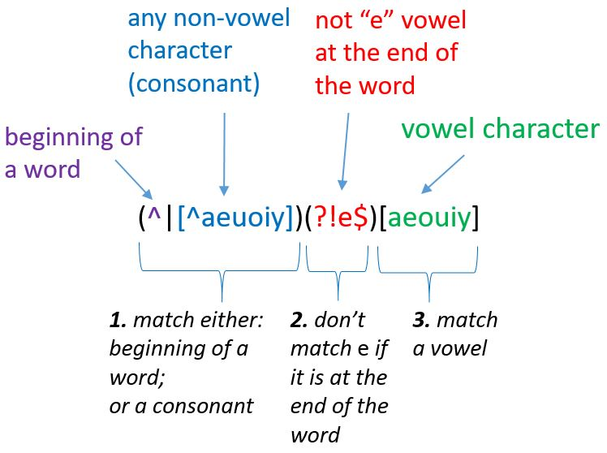
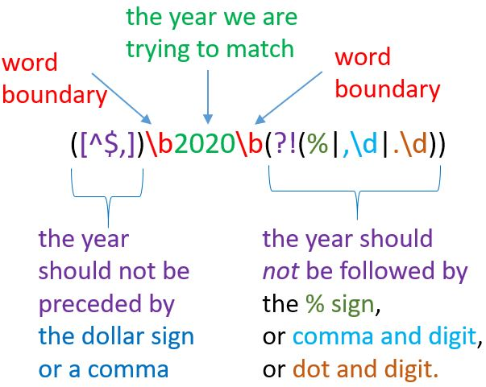
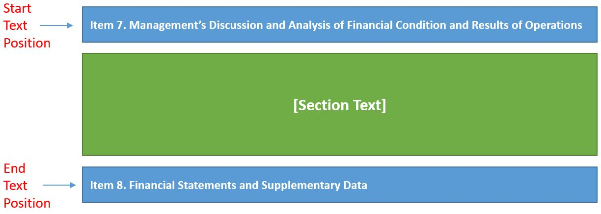
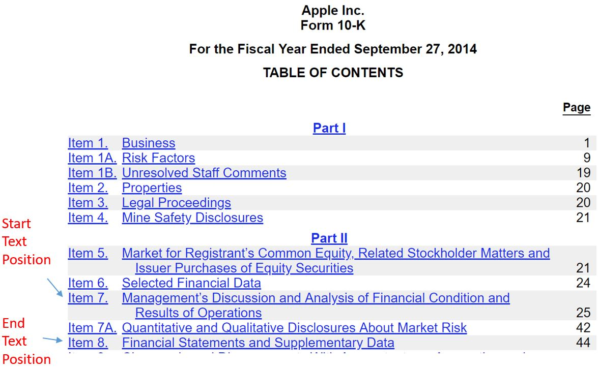
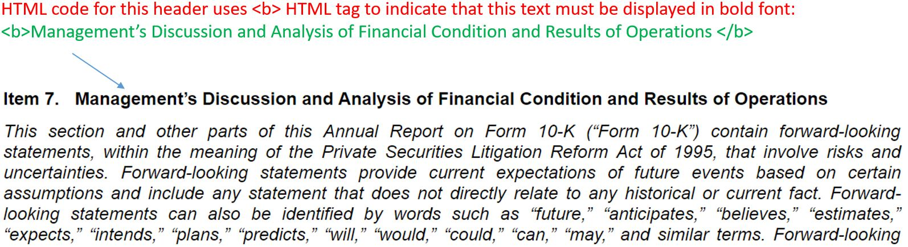
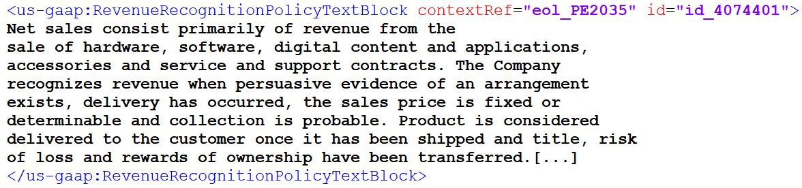

## Linguistic Measures of Disclosure Complexity

We can use textual analysis to measure the relative 'easiness' of disclosure textual content, which we will refer to as *disclosure complexity*. Disclosure complexity can reflect either the difficulty of reading a disclosure, or the difficulty of preparing a disclosure, or both. Some examples of complexity measures in accounting academic literature include:
1. Text length, measured as the number of words in a disclosure. We can measure length of the complete disclosure such as 10-K ([You and Zhang 2009]( https://doi.org/10.1007/s11142-008-9083-2); [Guay, Samuels, and Taylor 2016](https://doi.org/10.1016/j.jacceco.2016.09.001)), or parts of it (e.g., length of the revenue recognition footnote, [Peterson 2012](https://doi.org/10.1007/s11142-011-9164-5); accounting policy footnote, [Filzen and Peterson 2015](https://doi.org/10.1111/1911-3846.12135)) 
2. Text readability scores, **Fog** index ([Li 2008](https://doi.org/10.1016/j.jacceco.2008.02.003)) and **BOG** (plain-English) index ([Bonsall, Leone, Miller, and Rennekampe 2017](https://doi.org/10.1016/j.jacceco.2017.03.002));
3. Accounting standards complexity ([Chychyla, Leone, and Minutti-Meza 2018](https://doi.org/10.1016/j.jacceco.2018.09.005)).

### Disclosure Length

Disclosure length is simply a number of words in a disclosure text.
We already have a Python code that calculates the number of words in a text (the one we used to scale the linguistic tone variable):

#### Code:


```python
# We use a "word" regex expression discussed previously to count the number of words in a given text
import re

def get_words(input_text:str):
    words = re.findall(r'\b[a-zA-Z\'\-]+\b',input_text)
    return words

# calculate text length
def count_words (input_text:str):
    """Counts numbers of words in a given text."""
    words = re.findall(r'\b[a-zA-Z\'\-]+\b',input_text) #extract all words from input_text
    word_count = len(words) # calculates the number of all words in a given text
    return word_count
```

#### Example:


```python
#excerpt from Costco's 2015 MD&A section
mdna = """We believe that the most important driver of our profitability is sales growth, particularly comparable warehouse sales (comparable sales) growth. We define comparable sales as sales from warehouses open for more than one year, including remodels, relocations and expansions, as well as online sales related to websites operating for more than one year. Comparable sales growth is achieved through increasing shopping frequency from new and existing members and the amount they spend on each visit (average ticket). Sales comparisons can also be particularly influenced by certain factors that are beyond our control: fluctuations in currency exchange rates (with respect to the consolidation of the results of our international operations); and changes in the cost of gasoline and associated competitive conditions (primarily impacting our U.S. and Canadian operations). The higher our comparable sales exclusive of these items, the more we can leverage certain of our selling, general and administrative expenses, reducing them as a percentage of sales and enhancing profitability. Generating comparable sales growth is foremost a question of making available to our members the right merchandise at the right prices, a skill that we believe we have repeatedly demonstrated over the long term. Another substantial factor in sales growth is the health of the economies in which we do business, especially the United States. Sales growth and gross margins are also impacted by our competition, which is vigorous and widespread, across a wide range of global, national and regional wholesalers and retailers. While we cannot control or reliably predict general economic health or changes in competition, we believe that we have been successful historically in adapting our business to these changes, such as through adjustments to our pricing and to our merchandise mix, including increasing the penetration of our private label items.
Our philosophy is to provide our members with quality goods and services at the most competitive prices. We do not focus in the short term on maximizing prices charged, but instead seek to maintain what we believe is a perception among our members of our “pricing authority” – consistently providing the most competitive values. Our investments in merchandise pricing can, from time to time, include reducing prices on merchandise to drive sales or meet competition and holding prices steady despite cost increases instead of passing the increases on to our members, all negatively impacting near-term gross margin as a percentage of net sales (gross margin percentage). We believe that our gasoline business draws members but it generally has a significantly lower gross margin percentage relative to our non-gasoline business. A higher penetration of gasoline sales will generally lower our gross margin percentage. Rapidly changing gasoline prices may significantly impact our near-term net sales growth. Generally, rising gasoline prices benefit net sales growth which, given the higher sales base, negatively impacts our gross margin percentage but decreases our selling, general and administrative expenses as a percentage of net sales. A decline in gasoline prices has the inverse effect.
We also achieve sales growth by opening new warehouses. As our warehouse base grows, available and desirable potential sites become more difficult to secure, and square footage growth becomes a comparatively less substantial component of growth. The negative aspects of such growth, however, including lower initial operating profitability relative to existing warehouses and cannibalization of sales at existing warehouses when openings occur in existing markets, are increasingly less significant relative to the results of our total operations. Our rate of square footage growth is higher in foreign markets, due to the smaller base in those markets, and we expect that to continue. Our online business growth both domestically and internationally has also increased our sales.
Our membership format is an integral part of our business model and has a significant effect on our profitability. This format is designed to reinforce member loyalty and provide continuing fee revenue. The extent to which we achieve growth in our membership base, increase penetration of our Executive members, and sustain high renewal rates, materially influences our profitability.
"""

mdna_length = count_words(mdna)
print("Number of words in the MD&A section:", mdna_length)
```

### Gunning Fog Index
Fog index is a measure that estimates how difficult it is to read a piece of text. For a given text, it is a numerical score where greater values indicate more complex text in terms of readability. The score is a weighted sum of the average number of words per sentence and the average number of complex words (i.e., words with three or more syllables) per word:

\begin{equation}
0.4 \times \bigg[\frac{\text{all words}}{\text{all sentences}} + 100 \times \frac{\text{words with three or more syllables}}{\text{all words}} \bigg]
\end{equation}

Fog index scores roughly correspond to the following reading levels by grades: 

| Grade | Fog index   |
|------|------|
|College graduate | 17 |
|College senior | 16 |
|College junior | 15 |
|College sophomore | 14 |
|College freshman | 13 |
|High school senior | 12 |
|High school junior | 11 |
|High school sophomore | 10 |
|High school freshman | 9 |
|Eighth grade | 8 |
|Seventh grade | 7 |
|Sixth grade | 6 |

We have already discussed how to calculate the number of words in a text. We still need a method to calculate number of sentences and complex words.

### Identifying Sentences in a Text

We can use a regex expression to identify sentences in a text. First, we need to provide a definition of a sentence. In linguistics, a sentence is a textual unit delimited by graphological features such as UPPER case letters and markers such as periods, question marks, and exclamation marks (".", "!", "?"). Therefore, to identify a sentence, we need a Regex that will search for these features. The following Regex elements will help us to identify a sentence:
<br>
**\b** - a sentence should be preceded by a word boundary
<br>
**[A-Z]** - a sentence should start with a capital letter
<br>
**[\.!?]** - a sentence should should end with either ".", "!", or "?" 
<br>
**[^\.!?]*** - allowing for anything in between, but ".", "!", "?" 

#### Code:


```python
sentence_regex = re.compile(r'\b[A-Z][^\.!?]*[\.!?]')
def get_sentences (input_text:str):
    """Extracts sentences from a given text."""
    sentences = re.findall(sentence_regex, input_text)
    return sentences

sentences = get_sentences("FEDEX is experiencing strong growth in the US, where the economy remains solid. However, our international business, especially in Europe, weakened significantly since we last talked with you during our earnings call in September. In addition, China's economy has weakened due in part to trade disputes.  While international revenue was still growing, it is not growing at the rate we expected because of the overall global economic uncertainty. As a result, we have lowered our fiscal 2019 earnings guidance and are accelerating actions to reduce costs given the uncertainty of global macroeconomic trends. We are highly confident that we will achieve the benefits expected with the acquisition of TNT Express, although we will not achieve our FedEx profit improvement goal in fiscal 2019. [...] Like the rapid changes we have experienced, I'm confident that we will see improved operating earnings, margins and cash flow in FY '20 versus FY '19.")

for counter, sentence in enumerate(sentences, 1): # enumerate in Python adds a counter to a given list output; 1 indicates the start of the counter
    print(counter, sentence)
```

### Counting Syllables in Words

We will use a heuristic method to identify words with three or more syllables (complex words). A simple (albeit not 100% accurate) way to count syllables in words is to count the number of *vowels* that either are a) <span style="color:steelblue">at the beginning of a word</span> or b) <span style="color:purple"> follow a consonant</span>, and <span style="color:crimson">exclude vowel *e* if it the last character in a word</span>. 

Examples: R<span style="color:purple"><b>E</b></span>S<span style="color:purple"><b>E</b></span>ARCH (2 syllables), <span style="color:steelblue"><b>A</b></span>CC<span style="color:purple"><b>O</b></span>UNT (2 syllables), <span style="color:steelblue"><b>E</b></span>ASE (1 syllable).

The following regex can be used to "capture" all such vowels:



#### Code:


```python
#regex pattern to match vowels for syllable count
re_syllabels = re.compile(r'(^|[^aeuoiy])(?!e$)[aeouiy]', re.IGNORECASE)

def count_syllabels(word:str):
    """Counts number of syllabels in a word."""
    #match syllable regex pattern against the input word
    syllabels_matches = re_syllabels.findall(word) 
    #return the number of syllable matches
    return len(syllabels_matches) 

def is_complex_word(word:str):
    """Returns whether a word has three or more syllables."""
    return count_syllabels(word) >= 3

print("Number of syllables in word \"Textual\":",count_syllabels("Textual"))
print("Is word \"Textual\" complex:", is_complex_word("Textual"),"\n")

print("Number of syllables in word \"analysis\":",count_syllabels("analysis"))
print("Is word \"analysis\" complex?:",is_complex_word("analysis"),"\n")

print("Number of syllables in word \"procedure\":",count_syllabels("procedure"))
print("Is word \"procedure\" complex?:", is_complex_word("procedure"))
```

Now we can write a function to calculate the fog score of a given text:

#### Code:


```python
def get_fog(text:str):
    """Returns fog score for a given text (string)."""
    #extract all sentences from the input test
    sentences = get_sentences(text)
    #extract all words from the input test
    words = get_words(text)
    #create a separate list of complex words by using is_complex_word function as a filter
    complex_words = [word for word in words if is_complex_word(word)]
    #calculate fog (readability)score
    #function float below converts an interger to a real number so that we can calculate fractions
    return 0.4*( len(words)/len(sentences) + 100.0 * len(complex_words)/len(words) )

#Example:
fog_score = get_fog(mdna)
print("Readability (fog) score of Costco's 2015 MD&A section is", fog_score)
```

## Capturing Quantitative Content of Textual Disclosures
To better capture the content of disclosure, researchers often calculate the *number of informative numbers* (e.g., omitting dates, section
numbers, etc.) in disclosure text (e.g., see [Blankespoor 2016](https://www.gsb.stanford.edu/faculty-research/working-papers/impact-information-processing-costs-firm-disclosure-choice-evidence); [Dyer, Lang, and Stice-Lawrence 2017](http://dx.doi.org/10.1016/j.jacceco.2017.07.002), [Siano and Wysocki 2018](http://dx.doi.org/10.2139/ssrn.3223757)). 

A simple way to identify informative numbers is to create a regex which will check:
<br>
1\) <font color='blue'>if a number is preceded by the dollar sign (\\$) or followed by the percentage sign (\%) or the word percent</font>;
<br>
2\) <font color='blue'>if the number is followed by the words million/billion</font>. 

#### Code:


```python
def get_informative_numbers (input_text:str):
    """Counts the number of informative numbers as the percentage of total words"""
 
    # regex '\$[\d\.]+' captures a number precedded by $. For example, $100; $100,000; $100.100
    # regex [\d\.]+\smillion' captures a number followed by word "million". For example, 100 million.
    # regex [\d\.]+\sbillion' captures a number followed by word "billion". For example, 200 billion.
    count_monetary_numbers = len(re.findall(r'(\$[\d\.]+)|([\d\.]+\smillion)|([\d\.]+\sbillion)', input_text)) # gives you the number of times the regex pattern matches in text
    
    # capturing numbers in percentage terms. For example, 45%, 55.3%, 76 percent
    count_percentage_numbers = len(re.findall(r'[\d\.]+(%|\spercent)', input_text)) # gives you the number of times the regex pattern matches in text

    # total count of informative numbers
    count_informative_numbers = count_monetary_numbers + count_percentage_numbers # gives you the total count of informative numbers in text
    
    # sometimes it is useful to express the quantity of informative numbers in text as a percentage 
    words = re.findall(r'\b[a-zA-Z\'\-]+\b', input_text) # find all words in text
    total_words_count = len(words) # calculate the number of total words
    percentage_count_informative_numbers = 100*count_informative_numbers/total_words_count
    
    # output word count,  informative number count, and percentage of informative numbers in a text.
    return(total_words_count, count_informative_numbers, percentage_count_informative_numbers)

# running count_informative_numbers function
numbers = get_informative_numbers("CAF penetration net of three-day payoffs was consistent with last year’s third quarter at 44%. Our net loans originated in the quarter grew by 3.4 percent to $1.5 billion due to our sales growth and the increase in the average amount financed. CAF income increased 6.7% to $110 million. This was a result of the 8.4% growth in average managed receivables, partially offset by the continued slight compression in portfolio interest margin. Total portfolio interest margin was 5.6% of average managed receivables compared to 5.7% in both the third quarter of last year and this year's second quarter. During the third quarter, we repurchased 3.7 million shares for $254,000,000. And as you may have seen in the 8-K we filed in October of 2018, CarMax's Board of Directors also authorize a $2 billion expansion in the current repurchase program.")
print(numbers)
```

## Forward-Looking Statements (FLS)

Forward-looking statements in corporate disclosures convey information about expected events, trends, and management's strategies and plans, that can affect the firm's operations and economic environment. Because forward-looking disclosures are important to investors, The Private Securities Litigation Reform Act of 1995 introduced safe harbor provision for such disclosures, facilitating disclosures of forward-looking information.

To identify forward-looking statements, we will use the methodology developed in [Muslu, Radhakrishnan, Subramanyam, and Lim (2015)](https://doi.org/10.1287/mnsc.2014.1921). Specifically, [Muslu et al. (2015)](https://doi.org/10.1287/mnsc.2014.1921) classify a sentence as a forward-looking statement if it includes one of the following:

\- <font color='blue'>references to the future:</font> *will*, *future*, *next fiscal*, *next month*, *next period*, *next quarter*, *next year*, *incoming fiscal*, *incoming month*, *incoming period*, *incoming quarter*, *incoming year*, *coming fiscal*, *coming month*, *coming period*, *coming quarter*, *coming year*, *upcoming fiscal*, *upcoming month*, *upcoming period*, *upcoming quarter*, *upcoming year*, *subsequent fiscal*, *subsequent month*, *subsequent period*, *subsequent quarter*, *subsequent year*, *following fiscal*, *following month*, *following period*, *following quarter*, and *following year*;

\- <font color='green'>future-oriented verbs and their conjugations:</font> *aim*, *anticipate*, *assume*, *commit*, *estimate*, *expect*, *forecast*, *foresee*, *hope*, *intend*, *plan*, *project*, *seek*, and *target*;

\- <font color='purple'>reference to a year that comes after the year of the filing.</font> For example, *2019* if the filing's fiscal year is 2018. 
Note that to identify a year in text, you have to specify that a year cannot be a part of a (larger) number, or preceded by a dollar sign (*\$*), or followed by a percentage sign (*\%*), etc.

Examples of forward-looking sentences:

 - We still are bullish where we think we going to be in the <font color='blue'>**next year**</font>, and reaching 35% of the market.
 - Based on our forecast, we <font color='green'>**expect**</font> our 2006 tax rate to be approximately 15\%.
 - Capital spending may total roughly 300 million in <font color='purple'>**2020**</font>.


File *fls_terms.txt* includes all references to the future terms as well as future verbs and their conjugations. We will use this file to write a function in Python to classify a sentence either as forward-looking or not.

#### Code:


```python
#file path (location) to a text file with FLS terms (one term per line)
fls_terms_file = r"./dictionaries/fls_terms.txt"

#first we need to create a list of regex expressions that match FLS terms
def create_fls_regex_list(fls_terms_file:str):
    """Creates a list of regex expressions of FLS terms."""
    #create an object/variable that links to the FLS terms text file, and call it "file"
    #we only need to read (as opposed to write) the contents of the file; thus we will "open" the file in "r" (read) mode
    with open(fls_terms_file,"r") as file:
        #read the contents of the file, split it by lines, save the result to fls_terms list variable
        fls_terms = file.read().splitlines()
    #create a list of FLS regex expressions by adding word boundary (\b) anchors to the begining and the end of each FLS term
    fls_terms_regex = [re.compile(r'\b' + term + r'\b') for term in fls_terms]
    #return the list of FLS regex expressions as the function output
    return fls_terms_regex

#create a list of FLS regex expressions using the function above and call it "fls_terms_regex"
fls_terms_regex = create_fls_regex_list(fls_terms_file)
#print the first three regex expressions from the list above
print(fls_terms_regex[0:3])
```

## Using Regex to Identify Year Values in a Text

In addition to checking whether a sentence contains one of the FLS terms from *fls_terms.txt* file, we need to check whether it contains a reference to the next fiscal year. Hence, we need a method to identify years in a text. A year should be a standalone number (e.g., **2020**), and not a part of a larger number, monetary value, or percentage. (e.g., 9<b>2020</b>234, \$<b>2020</b>, <b>2020</b>\%). 

We will use the following regex expression to search for a specific year reference:



#### Code:


```python
def is_forward_looking(sentence:str, year:int):
    """Returns whether a sentence is an FLS sentence or not."""
    #create a regex expression to match references to the next five fiscal years
    #str(y) converts the numerical value of y (year) to text (string)
    future_year_terms = [re.compile(r"[^$,]\b" + str(y) + r"\b(?!(%|,\d|.\d))") for y in range(year+1,year+6)]
    
    #add next_year_re to the list of FLS regex expressions
    #you can add lists using + operator; example: [1,2] + [3,4] = [1,2,3,4]
    fls_terms_with_future_years = fls_terms_regex + future_year_terms
    
    #loop over each FLS term
    for fls_term in fls_terms_with_future_years:
        #check if the sentence contains the FLS term, i.e., whether the FLS regex term has a "match" in the sentence
            #fls_term.search(sentence) returns "None" if there is no FLS term match in the sentence
            #In Python, "None" means "False" for logical operators (such as "if")
            #fls_term.search(sentence) returns match object if there is a match; in this case it will be considered as "True" by the if statement.
        if fls_term.search(sentence):
            #if there is a match, return "True" as the function output (result)
            #the function (and the loop) will automatically break (finish) after we return "True" result
            return True
    #if there was no FLS term match, return "False" as the function output (result)
    #we will get to the line of code below only if we failed to find an FLS term match in the loop above
    return False
```

#### Example:


```python
 #excerpt from Apple's Q4 2018 Earnings Conference Call Transcript
text = """Finally, we launched a completely new website experience for Atlanta. The new online experience provides a modern and fresh brand look and includes enhanced simplicity and flexibility for shopping and buying that easily transitions to a home delivery or in-store experience. We are excited to put the customer in the driver seat. This experience is a unique and powerful integration of our own in-store and online capabilities. Keep in mind, we will continue to improve both the customer and associate experience in Atlanta and use these learnings to inform how we roll out into other markets. As we previously announced, we anticipate having the omnichannel experience available to the majority of our customers by February 2020. To expand omnichannel, we anticipate opening additional customer experience centers. We're currently in the process of planning the next locations while taking state regulations into consideration."""

#extract sentences form the text
sentences = get_sentences(text)

print ("***Forward-looking sentence classification example***")
#classify each sentence as forward looking or not
for sentence in sentences:
    print(is_forward_looking(sentence,2018),":", sentence)
  
#calcualte the percentage of forward-looking sentences:
forward_looking_sentences = [sentence for sentence in sentences if is_forward_looking(sentence, 2018)]
perc_fls = 100 * len(forward_looking_sentences) / len(sentences)
print ("\nPercentage of forward-looking sentences in the text:", perc_fls)
```

## Identifying Parts (Sections) of Documents

In many cases, we are interested in textual/linguistic properties of a certain part of a document rather than the whole document (e.g., MD&A section or tax footnote of a 10-K report). Therefore, we need a method to "extract" parts of documents. There are several approaches to this problem depending on the format of the underlying document.

1. **Plain-text format** 

    Plain-text documents are the simplest text documents that only include text characters with no images, special formatting, or other meta-data. Most corporate filings on EDGAR filed between 1993 and 1999 are in plain-text format.

    A common strategy is to identify the location (position) of the title (header) of the section of interest and the title of the subsequent section, and then extract all text in between:


    The challenge is that different filers (firms) use different styles to denote section titles. For example:
    - Item 7. Management's Discussion and Analysis of Financial Condition and Results
    - Item 7 - Management's Discussion and Analysis of Financial Condition and Results
    - ITEM 7.  MANAGEMENT'S DISCUSSION AND ANALYSIS OF FINANCIAL CONDITION AND RESULTS OF OPERATIONS
    - Management's Discussion and Analysis of Financial Condition and Results of Operations


2. **Hypertext Markup Language (HTML) format** 

    HTML documents are web documents with (hyper)links, images, tables, special text formatting (e.g., bold and italics fonts), and other features. Most corporate financial reports on EDGAR between 2000 and present are reported in HTML format. There are several methods to extract sections from HTML documents:

    **a)** Use embedded section links from the document's *table of contents*. This is the most reliable extraction method. However, not all financial reports on EDGAR include table of contents with links.
    
    
    **b)** Search for section titles text that are formated using title-like *HTML styles* (e.g., text that is centered, bold, emphasized, etc.):
    
    
    Just as with plain-text, different filers use different styles to denote titles in their documents.
    
    **c)** *Convert HTML* to a different format such as Markdown or plain-text. Section extraction from the latter formats is typically easier, but some helpful data can be lost after the conversion (e.g., bold or centered section headers). 
    
3. **eXtensible Business Reporting Language (XBRL) format** 

    XBRL documents are [Extensible Markup Language (XML)](https://en.wikipedia.org/wiki/XML) tagged data files designed to facilitate automated data extraction. Since June 15th, 2009, the largest filers (with public equity float greater than \$5 billion) have been filing their 10-Ks and 10-Qs using XBRL. All firms (with a few exceptions) have been mandated to file their 10-Ks and 10-Qs since June 15th, 2011. All financial statements and footnotes to them are tagged in XBRL documents using [FASB's US GAAP Financial Reporting Taxonomies](https://xbrl.us/home/filers/sec-reporting/taxonomies/). However, other sections (e.g., MD&A) are typically not tagged. 

    XBRL provides an easy way to identify text of footnotes to financial statements. For example Revenue Recognition Policy footnote typically is tagged using [*us-gaap:RevenueRecognitionPolicyTextBlock*](http://xbrlview.fasb.org/yeti/resources/yeti-gwt/Yeti.jsp#tax~(id~161*v~5016)!con~(id~3549973)!net~(a~3190*l~772)!lang~(code~en-us)!path~(wc)!rg~(rg~32*p~12)). An XML parser can be used to extract content (value) of such tagged data:
    
    
    
Below, we demonstrate how to extract a section from a plain-tax filing using a simplified example:

#### Code:
    


```python
#simple 10-K document structure
simplified_10k = """[Text before MD&A section]

Item 7. Management's Discussion and Analysis of Financial Condition 
and Results of Operations

The Company designs, manufactures and markets mobile communication and media devices, personal computers and portable digital music players, and sells a variety of related software, services, accessories, networking solutions and third-party digital content and applications. The Company sells its products worldwide through its retail stores, online stores and direct sales force, as well as through third-party cellular network carriers, wholesalers, retailers and value-added resellers. In addition, the Company sells a variety of third-party iPhone, iPad, Mac and iPod compatible products, including application software, and various accessories through its online and retail stores. The Company sells to consumers; small and mid-sized businesses; and education, enterprise and government customers. 

Fiscal 2014 Highlights 
 
Net sales rose 7% or $11.9 billion during 2014 compared to 2013. This was driven by increases in net sales of iPhone; Mac; iTunes, Software and Services; and Accessories. Net sales and unit sales increased for iPhone primarily due to the successful introduction of iPhone 5s and 5c in the latter half of calendar year 2013, the successful launch of iPhone 6 and 6 Plus beginning in the fourth quarter of 2014, and expanded distribution. Mac net sales and unit sales increased primarily due to strong demand for MacBook Air and MacBook Pro which were updated in 2014 with faster processors and offered at lower prices. Net sales of iTunes, Software and Services grew primarily due to increased revenue from sales through the App Store, AppleCare and licensing. Net sales and unit sales for iPad declined in 2014 compared to 2013 due to lower unit sales in many markets. Growth in total net sales during 2014 was also negatively impacted by the continuing decline of iPod sales. All of the Company’s operating segments other than the Rest of Asia Pacific segment experienced increased net sales in 2014, with growth being strongest in the Greater China and Japan operating segments. 

Item 8. Financial Statements and Supplementary Data

[Item 8 text]

[Text after Item 8]
"""

print(simplified_10k)
```


```python
#a regex to identify the location of Item 7 header
# re.DOTALL flag allows . character to match newline; this is useful if header spans multiple lines
item7_regex = re.compile(r"item.{1,5}7.{1,5}management.{1,5}discussion.{1,5}analysis", re.IGNORECASE | re.DOTALL) 

#Item 8 is typically called "Financial Statements and Supplementary Data"
#however, sometimes it may be called "Summary of Selected Financial Data" or similar
item8_regex = re.compile(r"item.{1,5}8.{1,5}(financial.{1,5}statements.{1,5}supplement.{1,5}data|summary.{1,5}selected.{1,5}financial.{1,5}data)", re.IGNORECASE | re.DOTALL)

#find position of Item 7 header
#method start() returns the position of the match
section_start_pos = re.search(item7_regex,simplified_10k).start()
#find position of Item 8 header
section_end_pos = re.search(item8_regex, simplified_10k).start()
#extract all text in between
#text[a:b] allows to extract text (substring) between a and b positions
item7_text = simplified_10k[section_start_pos:section_end_pos]

#display the text of the extracted section
print(item7_text)
```
